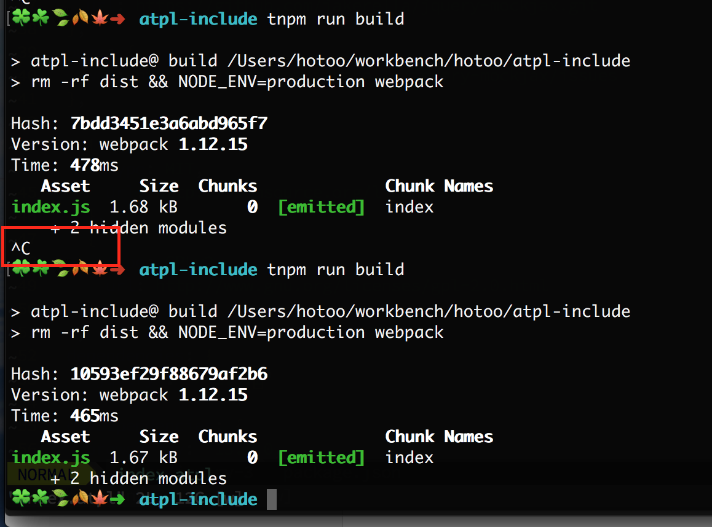

# README

这个仓库用于重现 [atpl-loader](https://github.com/sorrycc/atpl-loader) include 指令的一个编译问题。

```bash
$ npm install
$ npm run build
// 不能正常终止进程

// 删除 src/index.atpl 里的 include 指令
$ npm run build
// 正常终止进程
```

## Screen Shot


